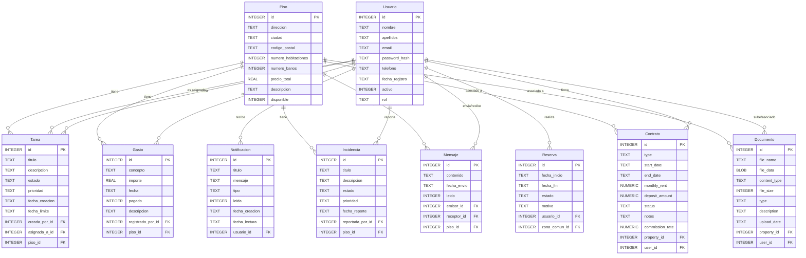

# Esquema de Base de Datos y Credenciales

## Esquema de la Base de Datos

A continuación se presenta el modelo Entidad-Relación actualizado de la base de datos de ConviApp, reflejando todas las entidades añadidas a lo largo del desarrollo (Contratos, Documentos, Reservas, Notificaciones, etc.):

## Usuarios y Contraseñas de Prueba

Para probar el correcto funcionamiento de la aplicación, se pueden utilizar las siguientes credenciales que ya están presentes en la base de datos por defecto:

### Administrador
- **Email:** `admin@conviapp.com`
- **Contraseña:** `admin123`
- **Rol:** Admin (Da acceso al panel de administración y control total).

### Usuario Básico (Ejemplo)
- **Email:** `daniramonpoveda@gmail.com`
- **Contraseña:** `1234`
- **Rol:** Básico (Da acceso a las vistas estándar de inquilino/propietario).
